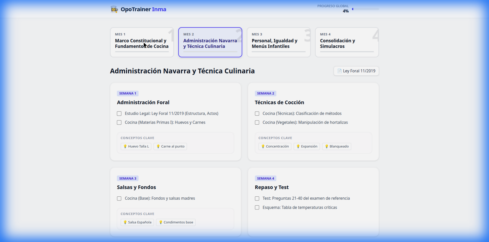

# 👩‍🍳 OpoTrainer Inma



> **Plataforma interactiva de estudio para Oposiciones de Cocina (Escuelas Infantiles Pamplona).**  
> Transforma un temario estático en una experiencia de aprendizaje gamificada, visual y persistente.

[](https://react.dev/)
[](https://vitejs.dev/)
[](https://tailwindcss.com/)
[](https://michel-macias.github.io/OpoTrainerInma/)

---

## 🚀 Live Demo
Accede a la aplicación en vivo aquí:  
👉 **[https://Michel-Macias.github.io/OpoTrainerInma/](https://Michel-Macias.github.io/OpoTrainerInma/)**

---

## 💡 Sobre el Proyecto

**OpoTrainer Inma** nace de la necesidad de modernizar el estudio de oposiciones. Lejos de los interminables PDFs y listas de papel, esta aplicación ofrece un entorno de **"Centro de Mando"** donde el opositor puede visualizar su progreso, acceder a los recursos legales al instante y gestionar su estudio semanal de forma eficiente.

### ✨ Características Clave

#### 1. 📅 Dashboard Inteligente (Smart Coach)
Tu entrenador personal automatizado que guía tu ciclo de estudio semanal:
*   **Lunes:** Notificaciones de lectura.
*   **Martes-Jueves:** Recordatorios para crear fichas de repaso.
*   **Viernes:** Sugerencias de test y simulacros.
*   **Month Guard 🔒:** Sistema de bloqueo que impide avanzar de mes hasta completar los objetivos del actual.

#### 2. ⏱️ Simulacro de Examen "Real"
Un módulo de test diseñado para recrear la presión del examen oficial:
*   **Cronómetro:** Cuenta atrás de 90 minutos.
*   **60 Preguntas:** Basadas en el examen oficial de "Cocineros Castellano".
*   **Corrección Inteligente:** Al finalizar, el sistema analiza tus fallos y te sugiere qué temas específicos (ej. "Tema 5: Admin Foral") necesitas reforzar.

#### 3. 📖 Explorador de Temario Interactivo
Olvídate de buscar en carpetas. Todo el temario organizado y accesible:
*   **Filtrado:** Por bloque (Legislativo vs Específico/Cocina).
*   **Recursos:** Acceso directo a PDFs oficiales desde cada tema.
*   **Fichas Digitales:** Crea tus propios resúmenes y flashcards integradas en cada tema.

#### 4. 🛠️ Herramientas de Estudio
*   **Persistencia de Datos:** Tu progreso se guarda automáticamente en `LocalStorage`.
*   **Diseño Responsive:** Optimizado 100% para estudiar en móvil, tablet u ordenador.

---

## 🛠️ Stack Tecnológico

Este proyecto ha sido construido utilizando tecnologías web modernas para garantizar velocidad y escalabilidad:

*   **Core:** [React](https://react.dev/) (v19)
*   **Build Tool:** [Vite](https://vitejs.dev/)
*   **Estilos:** [TailwindCSS](https://tailwindcss.com/)
*   **Iconos:** Lucide React
*   **Despliegue:** GitHub Pages (CI/CD automatizado con `gh-pages`)

---

## 🔧 Instalación Local

Si deseas ejecutar este proyecto en tu propia máquina:

1.  **Clonar el repositorio**
    ```bash
    git clone https://github.com/Michel-Macias/OpoTrainerInma.git
    cd OpoTrainerInma
    ```

2.  **Instalar dependencias**
    Navega al directorio de la aplicación web:
    ```bash
    cd web-app
    npm install
    ```

3.  **Iniciar servidor de desarrollo**
    ```bash
    npm run dev
    ```
    La aplicación estará disponible en `http://localhost:5173`.

---

## 📂 Estructura del Proyecto

El corazón de la aplicación reside en `web-app/src`:

*   `data/`:
    *   `curriculum.json`: Define el plan de estudios mensual.
    *   `topics.json`: Base de datos de los 25 temas del temario.
    *   `questions.json`: Banco de preguntas para el simulador.
*   `components/`:
    *   `SmartCoach.jsx`: Lógica del asistente diario.
    *   `TestSimulator.jsx`: Motor de exámenes y corrección.
    *   `SyllabusExplorer.jsx`: Visor de temas y recursos.
*   `App.jsx`: Componente principal y enrutador.

---

## 🤝 Contribución

Las sugerencias y Pull Requests son bienvenidas. Si tienes ideas para mejorar el temario o añadir nuevas funcionalidades (como tests interactivos), ¡no dudes en colaborar!

---

Hecho con ❤️ para el éxito en la oposición.
